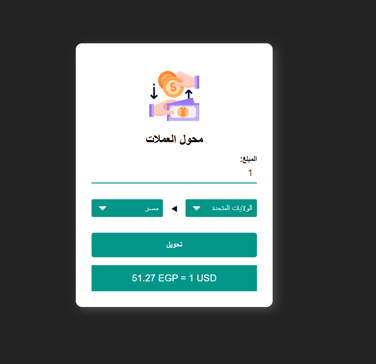

# 💱 Currency Converter App

A simple and responsive **Currency Converter** built using **HTML**, **CSS**, and **JavaScript**, powered by a real-time **Exchange Rate API**. Easily convert between different currencies with up-to-date rates.

## 🛠️ Tech Stack

- **HTML5** – Semantic layout  
- **CSS3** – Responsive styling  
- **JavaScript (ES6)** – Core logic and API handling  
- **Exchange Rate API** – For fetching live conversion rates

## ✨ Features

✅ **Real-Time Currency Conversion** using live API data  
✅ **Select Any Two Currencies** from dropdown lists  
✅ **Input Amount** to instantly get converted value  
✅ **Swapping Currencies** with a single click  
✅ **Responsive Design** for mobile and desktop  

## 🔌 API Used

- [currencyfreaks-API](https://currencyfreaks.com/)

## 📸 Preview

## 🚀 Live Demo

[🔗 View Live](https://ahmedragab15.github.io/Currency-Converter)